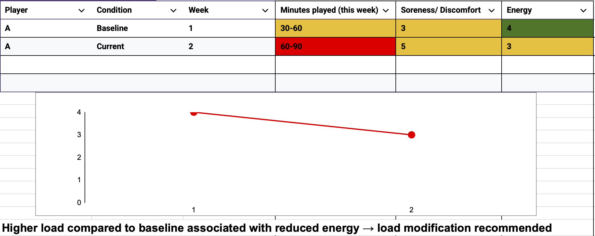

# athlete--monitoring--system-
Simple system for tracking load, fatigue and readiness 
A simple monitoring system designed to track player load, fatigue, and readiness across training weeks.

The goal is to support availability and performance through clear, practical decisions.
## Inputs

- Minutes (training/match load)
- Pain / Discomfort (0–10)
- Energy (1–5)
## Workflow

Flag → Review → Decide

- Identify high load or fatigue indicators
- Compare against baseline
- Make a simple decision
## Outputs

- Full Training
- Modify Training
- Flag for further review
## Example Insight

t
T
greengerald9
greengerald9
)

Baseline vs current comparison shows increased load with reduced energy.

→ Load modification recommended to support player readiness.
## AI-Supported Insights

Basic AI workflows can be used to summarise trends and flag potential fatigue risks based on monitoring inputs.

This supports decision-making without replacing practitioner judgement.
